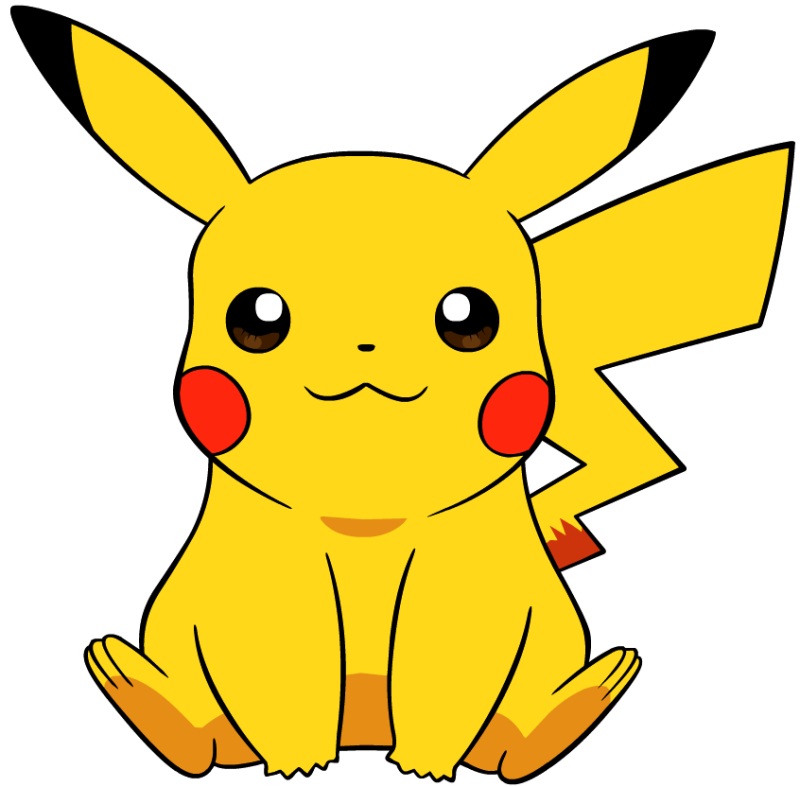

# [목차]
  1. 게임명
  2. 컨셉
  3. 관련 이미지, 영상
  4. 대표 이미지
  5. 컨셉, 대표 이미지 묘사
  6. 게임 구성 요소
  7. 게임 시스템 디자인  
     7-1. 게임 오브젝트 모델  
     7-2. 파라미터 분석  
     7-3. 오브젝트 행동  
     7-4. 오브젝트 상태  
     7-5. 게임 규칙  
  8. 개발 요구 사항  
     8-1. 요구 사항  
     8-2. 개발 완료한 사항  
  9. 흐름도
 10. 주차별 개발 내용  
     10-1. 1주차  
     10-2. 2주차  
     10-3. 3주차  
     10-4. 4주차  
     10-5. 5주차

## 두번째 서브제목

안녕하세요

### 세번째 서브제목

세번째 안녕

