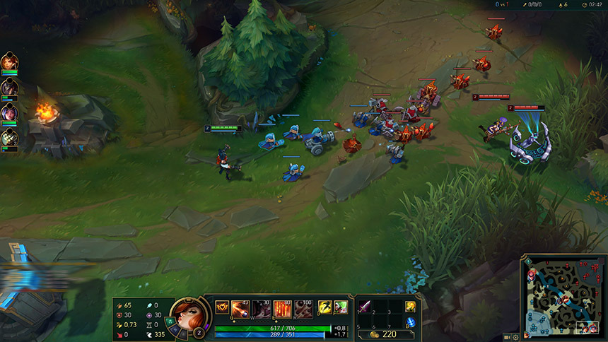
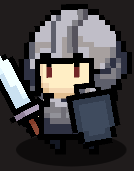
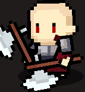
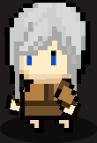

# 프로젝트명: 판타지 워 (이석천)

# [ 목차 ]
### 01. [컨셉 ](#1-컨셉)
### 02. [관련 이미지 & 동영상 ](#2-관련-이미지--동영상)
### 03. [구성 요소 ](#3-구성-요소)
### 04. [게임 시스템 디자인 ](#4-게임-시스템-디자인)
### 05. [요구 사항 ](#5-요구-사항)

  

# 1. [컨셉](#01-컨셉)

## 메인컨셉 : 경쟁

- 3명씩 팀을 이루어 3:3 전투를 벌이는 게임.
- 상대 기지를 공격해서 상대 기지를 먼저 파괴하는 팀이 승리.

#### 서브 컨셉 1 : 성장

- 플레이어는 몬스터를 사냥하면 경험치를 얻음.
- 얻은 경험치를 바탕으로 자신의 캐릭터를 강화함.

#### 서브 컨셉 2 : 다양성

- 플레이어가 조작 가능한 여러 캐릭터.
- 각 캐릭터 마다 능력치와 스킬이 달라 여러 플레이 경험을 제공.

#### 서브 컨셉 3 : 유동성

- 캐릭터들은 일정치 이상 성장할 경우 분기점을 맞이함.
- 분수령은 기존 캐릭터 특징을 강화하거나 변환시킴.
- 상황에 따라 각 플레이어들은 유동적으로 캐릭터를 성장시킬 수 있음.

<!--
#### 서브 컨셉 4 : 에픽 몬스터

- 맵 곳곳에 중립 몬스터 존재.
- 중립 몬스터를 사냥할 시 팀적인 이득을 제공함.
- 지루한 대치 상황을 타게하거나 역전의 발판이 될 수 있음.
-->

 

# 2. [관련 이미지 & 동영상](#02-관련-이미지--동영상)

- 이미지  
  
 
- 동영상

  

# 3. [구성 요소](#03-구성-요소)

## 1. 메커니즘

[도전 과제]

#### 1. 각 플레이어들은 게임이 시작하기 전에 자신이 조작할 캐릭터를 선택한다.
#### 2. 각 팀 기지에서 몬스터들이 나와 서로의 기지를 향해 이동한다.
#### 3. 각 플레이어 캐릭터들은 사망 후 일정 시간이 지나면 아군 기지에서 부활한다.
#### 4. 적군 플레이어 캐릭터를 처치했을 경우 추가 경험치를 획득한다.
#### 5. 적 몬스터를 처치하면 처치된 몬스터 근처의 아군 플레이어는 경험치를 나누어 받는다.
#### 6. 캐릭터들은 경험치가 일정 이상이 되면 레벨 업한다.
#### 7. 일정 레벨이 되면 캐릭터 특징을 강화하거나 변화시킨다.
#### 8. 상대 중앙 기지를 파괴하면 승리한다.

 

[재미 요소]

#### 1. 캐릭터 마다 능력치와 스킬이 달라 플레이마다 다른 경험을 제공다.
#### 2. 일정 레벨이 되면 캐릭터가 크게 강화되거나 특징이 변화하여 상황에 마다 다른 전략을 사용 할 수 있다.
#### 3. 승리하면 상대 팀을 이겼다는 성취감을 제공한다.
 

## 3. 미적요소

[디자인][컬러]  
- 도트 그래픽
- SPUM 에셋(2D 캐릭터 제작 툴 에셋)
-

[음향]  
- 에셋스토어 무료 음악
- 25 Fantasy RPG Game Tracks Music Pack 사용
- https://assetstore.unity.com/packages/audio/music/25-fantasy-rpg-game-tracks-music-pack-240154

 

# 4. [게임 시스템 디자인](#04-게임-시스템-디자인)

## 1. 게임 오브젝트

|연번|오브젝트명|오브젝트 이미지|
|:----:|:----:|:----:|
|01|미니언| |
|02|타워||
|03|넥서스||
|04|방패병||
|05|기사||
|06|전사||
|08|마법사||
|09|초능력자||
|09|궁수||

# 5. [요구 사항](#05-요구-사항)
