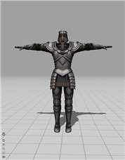
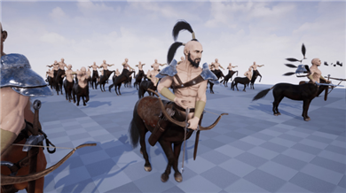
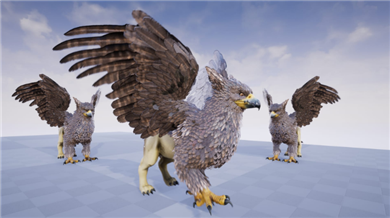
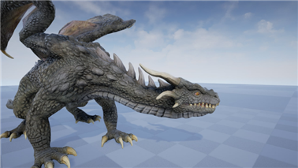
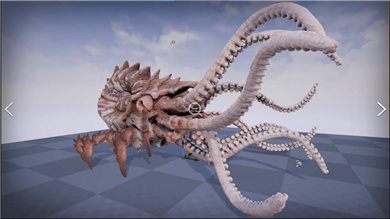
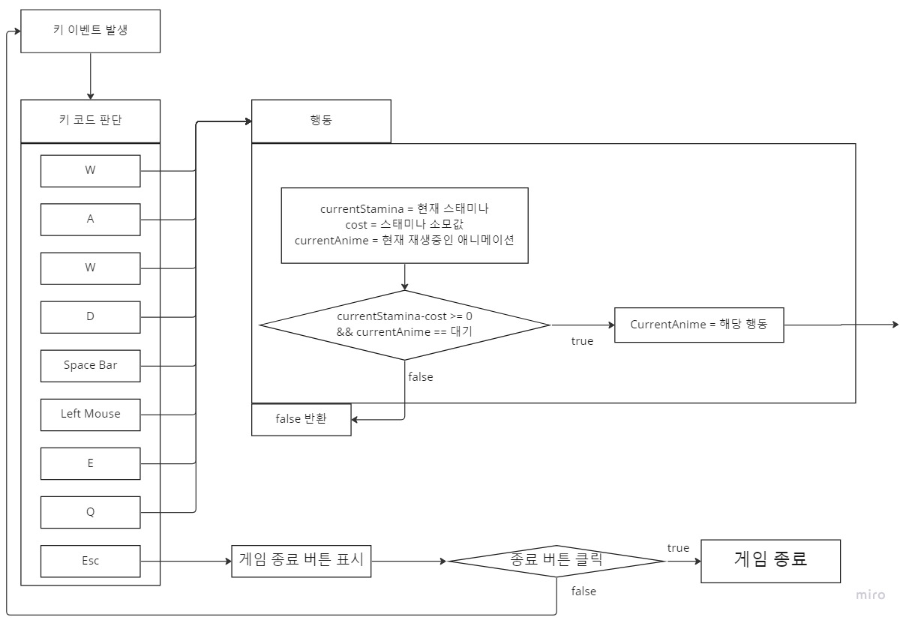
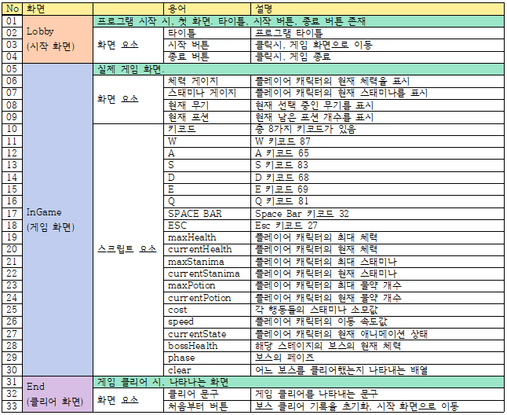

# 프로젝트명: 보스 헌터 (이석천)

# [ 목차 ]
### 01. [컨셉 ](#1-컨셉)
### 02. [관련 이미지와 동영상 ](#2-관련-이미지--동영상)
### 03. [대표 이미지 ](#3-대표-이미지)
### 04. [컨셉 & 대표이미지 기반 작품묘사 ](#4-컨셉--대표이미지-기반-작품묘사)
### 05. [보스 헌터 구성 요소 ](#5-보스-헌터-구성-요소)
### 06. [게임 시스템 디자인 ](#6-게임-시스템-디자인)
### 07. [요구 사항 ](#7-요구-사항)
### 08. [키보드 이벤트 흐름도 ](#8-키보드-이벤트-흐름도)
### 09. [용어 정리 ](#9-용어-정리)
### 10. [스토리 보드 ](#10-스토리-보드)
### 11. [프로토타입 개발 요구사항(6주개발) ](#11-프로토타입-개발-요구사항6주개발)
### 12. [프로토타입 개발작업 일정(6주개발) ](#12-프로토타입-개발작업-일정6주개발)

# 1. [컨셉](#01-컨셉-)

## 메인컨셉 : 타이밍

- 몬스터의 공격에 맞춰 회피를 하면 피해를 받지 않는 컨셉입니다. 레벨과 장비가 낮거나 좋지 않더라도 타이밍을 잘 맞춘다면 게임의 클리어가 가능합니다.

#### 서브 컨셉 1 : 무기

- 한 가지 공격 방식으로만 하면 사용자가 쉽게 질릴 수 있으므로 다양한 무기로 플레이어의 여러 공격 방식 제공.

#### 서브 컨셉 2 : 약점 공략

- 몬스터 마다 다른 약점을 만들어 차이를 두어 사용자가 약점을 공략하는 재미를 느낄 수 있도록 합니다.

#### 서브 컨셉 3 : 패턴

- 몬스터의 공격 패턴이 한 가지라면 플레이가 너무 단조로움으로 몬스터 패턴을 여러가지를 만들어 단조로움을 느끼지 않도록 합니다.
- 몬스터의 패턴이 다를 때, 패턴마다 준비 동작이 구분이 안 간다면 사용자는 스트레스를 받을 것이므로 패턴 간 준비 동작은 확실히 구분이 가능하도록 합니다.
- 구분은 준비 동작 애니메이션, 소리, 이펙트 등으로 표현합니다.

#### 서브 컨세 4 : 스태미나

- 플레이어의 모든 행동에 스태미나가 소모. 플레이어의 무분별한 액션을 방지하고 타이밍에 집중하도록 함.

#### 서브 컨세 5 : 안전 지역

- 전투만 지속하면 사용자의 피로감을 빠르게 증가시키므로 중간중간 안전한 지역을 만들어 사용자가 피로감을 덜 느끼도록 합니다.

  

# 2. [관련 이미지 & 동영상](#02-관련-이미지--동영상-)

- 이미지  
  
 
- 동영상

  

<!-- <video src='./img/관련영상.mp4' width=600/> -->

  

# 3. [대표 이미지](#03-대표-이미지-)

  

# 4. [컨셉 & 대표이미지 기반 작품묘사](#04-컨셉--대표이미지-기반-작품묘사-)
> ### 대표이미지 기반 : 

 - 체력, 스태미나 : 좌 상단 배치 - 전투 중 가장 중요한 요소이기 때문

 - 무기와 소모품: 좌 하단 배치 - 체력과 스태미나 다음으로 중요한 요소이기에 우 상단 혹은 좌 하단 배치. 그러나, 우 상단은 몬스터의 패턴을 가릴 위험이 있고 체력과 스태미너 위치와 거리가 멀기에 좌 하단 배치.

 - 이외 : 중요도가 낮고 몬스터의 패턴을 가릴 수 있기에 삭제 혹은 좌 하단 배치.

# 5. [보스 헌터 구성 요소](#05-보스-헌터-구성-요소-)

## 1. 메커니즘

[도전 과제]

#### 1. 플레이어의 도전 횟수 제한은 없다..
#### 2. 4가지 보스룸 중 하나에 들어가면 전투가 시작된다. 전투가 시작되면 후퇴가 불가능하다.
#### 3. 보스의 공격을 회피하면서 보스를 공격한다. 보스의 체력이 0이 되면 승리한다.
#### 4. 각 보스 마다 무기를 드랍한다.
#### 5. 인벤토리에서 무기를 변경하는 것이 가능하다.
#### 6. 4가지 보스를 모두 잡으면 게임은 클리어 된다.

[재미 요소]

#### 1. 보스마다 패턴이 다르다.
#### 2. 보스의 체력이 일정량 이하로 내려가면 새로운 패턴이 등장한다.
#### 3. 보스마다 다른 무기를 드랍하고 무기마다 다른 공격 방식을 사용한다.

 

## 2. 이야기

[만들게 된 배경]  
- DARK SOUL 3에서의 경험이 강렬했기에 남들에게 기억될만한 재미있는 게임을 만들고 싶어 이 게임을 모티브로 개발하기로 생각했습니다.

[카메라 관점]  
- 한 가지 카메라 시점. 플레이어 캐릭터 뒤에서 캐릭터의 전방을 주시.

 

## 3. 미적요소

[디자인][컬러]  
- 플레이어 캐릭터는 중세 기사 모습.
- 보스들은 각각 다른 모습.

[음향]  
- 배경 음악 - 웅장하고 긴장감 있는 음악.
- 보스 공격 효과음 - 묵직한 느낌의 효과음.
- 피격 효과음 - 둔탁하고 강철을 때리는 듯한 효과음.

 

## 4. 기술

- PC용 게임으로 구상. 대중적인 사양으로도 구동에 문제 없도록 개발 예정

# 6. [게임 시스템 디자인](#06-게임-시스템-디자인-)

## 1. 게임 오브젝트 분해

|연번|오브젝트명|오브젝트 이미지|
|:----:|:----:|:----:|
|01|플레이어 캐릭터||
|02|검||
|03|도끼||
|04|창||
|05|활||
|06|보스_동||
|08|보스_서||
|09|보스_남||
|09|보스_북||

## 2. 파라미터

### 1) 오브젝트 이름 : 플레이어 캐릭터

|속성|영문 명칭|설명|비고|
|:----:|:----:|:----:|:----:|
|최대 체력|MaxHealth|데미지를 전혀 입지 않은 상태의 체력 값. 이 이상 현재 체력은 높아지지 않음||
|현재 체력|CurrentHealth|적의 공격을 얼마나 견딜 수 있는지 나타내는 수치. 0이 되면 사망||
|최대 스태미나|MaxStamina|행동을 전혀 하지 않은 상태의 스태미나 값. 이 이상 현재 스태미나는 높아지지 않음||
|현재 스태미나|CurrentStamina|캐릭터의 행동에 소모되는 값. 행동 필요 수치보다 낮을 시 해당 행동 불가.||
|이동 속도|Speed|캐릭터의 기본 이동 속도.||
|현재 무기|Weapon|현재 사용 중인 무기를 나타내는 수치||
|소유 무기|haveWeapon|현재 소유 중인 무기. false인 무기는 무기 변경시 건너 뜀||
|최대 물약 개수|MaxPotion|물약을 사용하지 않았을 때의 개수||
|현재 물약 개수|CurrentPotion|물약을 얼마나 사용 가능한지 나나태는 수치. 물약 사용시 1씩 소모. 0일시 물약 사용 불가. 리스폰, 정비 시 현재 개수는 최대 개수의 수치로 설정||

### 2) 오브젝트 이름 : 검

|속성|영문 명칭|설명|비고|
|:----:|:----:|:----:|:----:|
|float|damage|공격이 몬스터에게 닿았을 시, 몬스터의 체력을 감하는 수치||

### 3) 오브젝트 이름 : 도끼

|속성|영문 명칭|설명|비고|
|:----:|:----:|:----:|:----:|
|float|damage|공격이 몬스터에게 닿았을 시, 몬스터의 체력을 감하는 수치||

### 4) 오브젝트 이름 : 활

|속성|영문 명칭|설명|비고|
|:----:|:----:|:----:|:----:|
|float|damage|공격이 몬스터에게 닿았을 시, 몬스터의 체력을 감하는 수치||

### 5) 오브젝트 이름 : 창

|속성|영문 명칭|설명|비고|
|:----:|:----:|:----:|:----:|
|float|damage|공격이 몬스터에게 닿았을 시, 몬스터의 체력을 감하는 수치||

### 6) 오브젝트 이름 : 보스

|속성|영문 명칭|설명|비고|
|:----:|:----:|:----:|:----:|
|최대 체력|bMaxHealth|데미지를 전혀 입지 않은 상태의 체력 값.||
|현재 체력|bCurrentHealth|적의 공격을 얼마나 견딜 수 있는지 나타내는 수치. 0이 되면 사망||
|피해량|Damage|몬스터의 공격이 플레이어 캐릭터에게 접촉했을 시, 플레이어 캐릭터의 체력을 감하는 수치||
|이동 속도|bSpeed|몬스터의 이동 속도||
|거리|Distance|플레이어 캐릭터와 몬스터 사이의 거리. 거리가 일정 이상이면 패턴을 특정 수치로 고정.||
|도약 거리|JumpDistance|거리가 도약 거리 이상일 때, 패턴 수치 고정||
|공격 거리|AttackDistance|몬스터가 플레이어 캐릭터에게 접근하는 최소 거리||
|패턴|Pattern|몬스터의 공격 패턴을 결정하는 난수 이 수치에 따라 패턴 결정||

## 3. 행동

### 1) 오브젝트 이름 : 플레이어 캐릭터

|행동|영문 명칭|설명|
|:----:|:----:|:----:|
|이동|Move|이동 조작키를 입력 했을 때의 행동|
|공격|Attack|공격키 (마우스 좌클릭)를 입력 했을 때의 행동|
|회피|Avoid|회피키를 입력 했을 때의 행동|
|물약 사용|Drink|물약 사용키를 입력 했을 때의 행동|

### 2) 오브젝트 이름 : 보스

|행동|영문 명칭|설명|
|:----:|:----:|:----:|
|이동|Move|플레이어 캐릭터를 향해 이동하는 행동|
|도약|JumpAttack|플레이어와의 거리를 빠르게 좁히는 행동|
|패턴01|pattern01|공격 패턴1|
|패턴02|pattern02|공격 패턴2|
|패턴03|pattern03|공격 패턴3|
|패턴04|pattern04|공격 패턴4 현재 체력이 최대 체력의 50% 미만일 때부터 패턴에 추가|

## 4. 상태

### 1) 오브젝트 이름 : 플레이어 캐릭터

### 2) 오브젝트 이름 : 보스

## 5. 게임 규칙

### 1) 핵심 규칙

1. 스테이지는 총 5개(중앙, 동서남북). 중앙을 제외한 각 스테이지는 각각 다른 보스가 존재.
2. 플레이어 캐릭터와 보스는 서로의 공격을 받으면 현재 체력이 감소.
3. 보스 체력이 0 이하가 되면 해당 보스 클리어.
4. 네가지 보스를 모두 클리어하면 제단 활성화.
5. 활성화 된 제단을 사용하면 게임 클리어.

### 2) 보조 규칙

1. 스테이지에 입장 할 때마다 보스는 초기 상태로 초기화.
2. 스테이지에 입장하면 리스폰 전까지 퇴장 불가.
3. 보스 클리어시 해당 보스는 다시 나오지 않음.
4. 플레이어 캐릭터의 체력이 0이 되면 중앙 스테이지에서 리스폰.
5. 기본 이동을 제외한 모든 행동에 스테미나 소모. 스테미나 부족 시, 해당 행동 불가.
6. 스테미나는 스테미나를 소모하는 행동을 하지 않을시 천천히 회복.

# 7. [요구 사항](#07-요구-사항-)

## 7-1. 시작 화면
### 1. UI
#### a. 화면 중앙에 위에서부터 타이틀, 시작 버튼, 종료 버튼
  - 타이틀의 글자 높이는 화면의 약 1/4
  - 각 버튼들의 높이는 화면의 약 1/8
  - 타이틀, 각 버튼들의 간격은 화면의 약 1/32

### 2. 기능
#### a. 시작 버튼
  - 클릭 시, 게임 화면(중앙 스테이지)으로 화면 전환
#### b. 종료 버튼
  - 클릭 시, 게임 종료

## 7-2. 게임 화면
### 1. UI
#### a. 좌상단에 위에서부터 체력바, 기력바
  - 바들의 시작 위치는 화면의 약 1/32 지점
  - 바들의 넓이는 화면의 약 1/4 넓이
  - 체력바의 시작 위치는 화면의 약 1/32 지점
  - 바들의 높이는 화면의 약 1/32 높이
  - 체력바와 기력바의 간격은 각 바들의 높이 만큼
  - 체력바는 다홍색, 기력바는 풀색
#### b. 좌하단에 물약 아이콘(이하 아이콘)과 갯수
  - 아이콘의 시작 위치는 화면의 약 1/32 지점
  - 아이콘은 한변의 길이가 화면 넓이의 약 1/32인 정사각형
  - 화면 바닥과의 간격은 아이콘의 간격은 아이콘의 높이
  - 아이콘의 우하단에 갯수 표시
  - 갯수를 표시하는 숫자의 높이는 아이콘의 높이의 절반
#### c. 메뉴창
  - 메뉴창은 화면 중앙에 위치
  - 메뉴는 위에서 부터 돌아가기, 무기 변경, 게임 종료 버튼
  - 메뉴의 높이는 화면 높이의 약 1/2 높이
  - 메뉴의 각 버튼의 높이는 메뉴의 높이의 약 1/4 높이
#### d. 무기 변경창
  - 화면 중앙에 각 무기들 아이콘 표시
  - 좌측부터 검 창 도끼 활 아이콘
  - 각 아이콘은 한변의 길이가 화면 높이의 약 1/4인 정사각형
  - 각 아이콘 간 간격은 아이콘 길이의 절반

### 2. UI 기능
#### a. UI - 체력바, 기력바
  - 체력바 : 매 프레임마다 플레이어 최대 체력과 현재 체력의 퍼센트만큼 길이 갱신
  - 기력바 : 매 프레임마다 플레이어 최대 기력과 현재 기력의 퍼센트만큼 길이 갱신
#### b. UI - 물약 아이콘
  - 매 프레임마다 물약의 갯수 갱신
#### c. UI - 메뉴창
  - esc키를 누르면 메뉴창과 마우스 커서를 표시
  - 메뉴창이 표시된 상태에서 esc를 누르면 메뉴창과 마우스 커서 숨김
  - 돌아가기 버튼 : 클릭 시, 메뉴창과 마우스 커서 숨김
  - 무기 변경 버튼 : 클릭 시, 메뉴창을 숨기고 무기 변경창 표시
  - 게임 종료 버튼 : 클릭 시, 각 보스 클리어 현황 저장 및 게임 종료
#### d. UI - 무기 변경창
  - 무기 변경창이 표시된 상태에서 esc키를 누를 시, 무기 변경창과 마우스 커서 숨김
  - 각 무기 아이콘 클릭 시, 해당 아이콘의 무기로 무기를 변경
  - 착용 중인 무기는 하얀색으로 표시
  - 아직 해금되지 않은 무기는 반투명하게 표시
  - 해금되지 않은 무기 아이콘 클릭 시, 무반응
### 3. 게임 플레이 기능
#### a. 플레이어 캐릭터 조작
  - 플레이어의 행동 중 스태미나 필요 행동들은 소모값보다 현재 스태미나가 적으면 행동하지 않음
  - 각 행동 중 피격 당하면 해당 애니메이션을 즉각 취소하고 피격 애니메이션 재생
  - 이동을 제외한 애니메이션들은 플레이어 임의로 취소 불가
  - WASD키 : 플레이어 캐릭터 이동 애니메이션, 캐릭터 정면은 이동 방향을 향함
  - Space바 : 캐릭터가 바라보는 방향으로 구르기 애니메이션. 스태미나 필요. 회피 애니메이션중엔 피격 당하지 않음
  - 좌클릭 : 캐릭터의 무기에 따라 공격 애니메이션. 스태미나 필요. 공격 범위에 몬스터가 있으면 무기 데미지 입힘
  - E키 : 물약 사용. 물약 애니메이션. 물약 회복량 만큼 일정한 속도로 체력 회복. 최대 체력 이상으로 회복되지 않음
#### b. 각 보스 공통 사항
  - 보스가 있는 스테이지에 플레이어 진입 시, 플레이어 캐릭터를 향해 이동
  - 공격 애니메이션 중 공격 범위에 캐릭터 접촉시 캐릭터에게 데미지를 입힘
  - 캐릭터와의 거리가 도약거리 이상이면 도약 공격 애니메이션
  - 캐릭터와의 거리가 공격 거리 이하이면 일반 공격

# 8. [키보드 이벤트 흐름도](#08-키보드-이벤트-흐름도-)

# 9. [용어 정리](#09-용어-정리-)

# 10. [스토리 보드](#10-스토리-보드-)

# 11. [프로토타입 개발 요구사항(6주개발)](#11-프로토타입-개발-요구사항6주개발-)
## 11-1. 1주차
### 캐릭터 이동 구현
  - 캐릭터 기본 이동
## 11-2. 2주차
### 캐릭터 행동 구현
  - 회피
  - 공격
  - 물약 사용
  - 사망
  - 피격 
## 11-3. 3주차
### 몬스터 공통 ai 구현
  - 이동
  - 기본 공격
  - 도약 공격
  - 사망
### 각 보스 ai 구현
  - 스테이지_동
  - 스테이지_서
  - 스테이지_남
  - 스테이지_북
## 11-4. 4주차
### UI 개발
  - 시작 화면
  - 메뉴창
  - HP바
  - STAMINA바
### 스테이지 이동
  - 시작화면 -> 게임화면
  - 중앙 스테이지 -> 각각 스테이지
  - 캐릭터 사망 시, 중앙 스테이지
## 11-5. 5주차
### 스테이지 환경 조성
  - 스테이지_동
  - 스테이지_서
  - 스테이지_남
  - 스테이지_북
## 11-6. 6주차
### 사운드
  - 배경 음악
  - 효과음
### 기타
  - 디버깅 & 테스트
  - 기타 미비 항목

# 12. [프로토타입 개발작업 일정(6주개발)](#12-프로토타입-개발작업-일정6주개발-)
