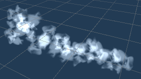

# [목차]
 01. 게임명
 02. 컨셉
 03. 관련 이미지
 04. 대표 이미지
 05. 컨셉, 대표 이미지 묘사
 06. 게임 구성 요소
 07. 게임 시스템 디자인 
     7-1. 게임 오브젝트 모델 
     7-2. 파라미터 분석 
     7-3. 오브젝트 행동 
     7-4. 오브젝트 상태 
     7-5. 게임 규칙
 08. 주차별 개발 내용 
     08-1. 1주차 
     08-2. 2주차 
     08-3. 3주차 
     08-4. 4주차 
     08-5. 5주차

# 01. 게임명: 매직마니아
게임명은 매직 마니아입니다. 마법을 뜻하는 매직과 애호가를 뜻하는 마니아를 합한 이름입니다.
다양한 마법을 사용하며 강화하거나 서로 조합하는 게임의 컨셉을 나타냅니다

# 02. 컨셉
## 메인컨셉: 핵앤 슬래쉬
  ○ 몰려오는 적들을 모아서 스킬로 처치하는 재미
### 서브 컨셉 1: 스킬 조합
  ○ 여러 태그들의 조합으로 다양한 효과의 스킬을 조합할 수 있음
### 서브 컨셉 2: 간편한 조작
  ○ 게임을 처음 해본 사람도 쉽게 숙달해 즐길 수 있게함. 
  ○ 키보드 (혹은 조이스틱) 로 이동, 마우스 방향으로 스킬 사용.
  
 # 03.관련 이미지
 
컨셉 예시

# 05. 컨셉, 대표 이미지 묘사
### 대표이미지 기반
키보드로 이동하며 좌,우,스페이스바 키로 스킬을 사용하여 플레이어에게 달려드는 적들을 쓰러트리는 게임
### 컨셉 기반
플레이어는 여러 태그를 조합해서 다양한 스킬을 선택하고 체험하는 재미를 느낄 수 있도록 함.

#  06. 게임 구성 요소
### 메커니즘
몰려오는 적들을 스킬을 사용하여 공격
보스 몹을 쓰러트리면 새로운 스킬 해금
몹들을 쓰러트리면 포션 충전
### 스토리
원인 모를 재앙을 막는 마법사 스토리
스토리보다 게임 플레이 중점

# 07. 게임 시스템 디자인
## 7-1. 게임 오브젝트 모델
### 플레이어 모델

### 적 모델

### 기본 스킬

### 폭발 이펙트

## 7-2. 파라미터 분석
### 플레이어 파라미터
|속성|속성값|설명|비고|
|---|---|---|---|
|이동 방향|Vector3|플레이어가 이동할 방향| 마우스 벡터-플레이어 벡터|
|이동 속도|7f|플레이어가 이동할 때 속도|적보다는 빨라야 함|
|공격 오브젝트|GameObject|좌클릭으로 적을 공격할 때 생성될 오브젝트||
|공격주기|0.7f|공격을 다시 사용하기까지 걸리는 시간||
|HP|100f|모두 소모될 시, 게임 오버가 되는 수치||
|MP|100f|스킬 사용시 필요한 자원 수치||
### 적 파라미터
|속성|속성값|설명|비고|
|---|---|---|---|
|이동 방향|Vector3|적이 이동할 방향| 플레이어 벡터 - 적 벡터|
|이동 속도|4f|적이 이동할 때 속도||
|체력|60f|적을 처치하기 위해 소모시켜야 할 수치||
|공격 주기|0.6f|공격을 다시하기까지 걸리는 시간||
|공격력|20f|적군이 공격할 때 플레이어의 체력을 감하는 수치||
### 기본 스킬 파라미터

|속성|속성값|설명|비고|
|---|---|---|---|
|데미지|40f|공격이 입히는 피해량||
|엘리멘트|열거형{fire, ice, wind, dust}|피격당한 적이 받는 디버프 종류||
|무브|열거형{None, Throw}|스킬이 실행, 이동하는 형태||
|임팩트|열거형{replica,explosion}|스킬이 적중할 때, 발동하는 효과||
|트리거|열거형{single,double,triple}|스킬이 사용될 때 발동되는 효과||
## 7-3. 오브젝트 행동
### 플레이어 행동

|행동|설명|
|---|---|
|이동|키보드 입력에 따라 이동|
|공격|좌클릭, 우클릭으로 스킬 사용|
## 7-4. 오브젝트 상태
### 플레이어 상태

|현상태|전이상태|전이조건|
|---|---|---|
|대기|이동|플레이어가 키보드(WASD)를 입력 했을 때|
|대기|공격|플레이어가 우클릭 혹은 좌클릭 했을 때|
|이동|공격|플레이어가 우클릭 혹은 좌클릭 했을 때|
|이동|사망|플레이어 HP가 0이 됬을 때|
|공격|사망|플레이어 HP가 0이 됬을 때|
|대기|사망|플레이어 HP가 0이 됬을 때|
### 적 상태

|현상태|전이상태|전이조건|
|---|---|---|
|대기|추적|플레이어가 사정거리 밖에 있을 때|
|추적|공격|플레이어가 사정거리 안에 있을 때|
|공격|사망|적의 HP가 0이 됬을 때|
|추적|사망|적의 HP가 0이 됬을 때|
